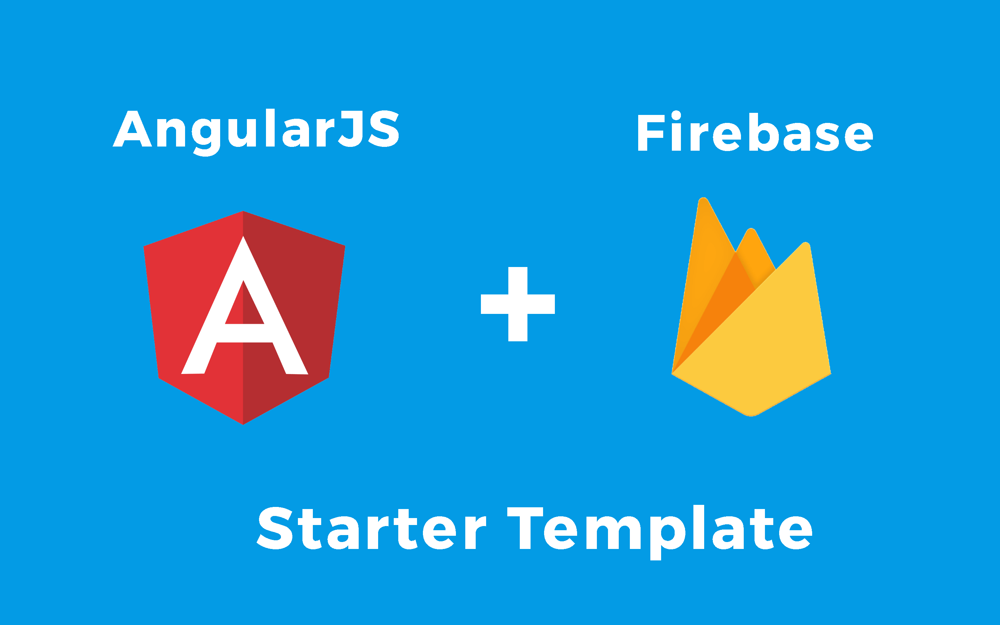

<p align="center">
  <h2 align="center">AngularJS + Firebase StarterTemplate</h2>
</p>



AngularJS + Firebase Starter template to kick start your new project. With the newest, Firebase Database and Firebase Auth, and Angular JS
Rather than use `new Firebase(url)` like with the old SDK, you now configure firebase with `firebase.initializeApp(config)`,
and use the new `firebase.database().ref()` method.

```js
 // Initialize Firebase
  var config = {
    apiKey: "<YOUR-API-KEY>",
    authDomain: "<YOUR-AUTH-DOMAIN>",
    databaseURL: "<YOUR-DATABASE-URL>",
    projectId: "<YOUR-PROJECT-ID>",
    storageBucket: "<YOUR-STORAGE-BUCKET>",
    messagingSenderId: "<YOUR-MESSANGING-SENDER-ID>"
  };
  firebase.initializeApp(config);
```
